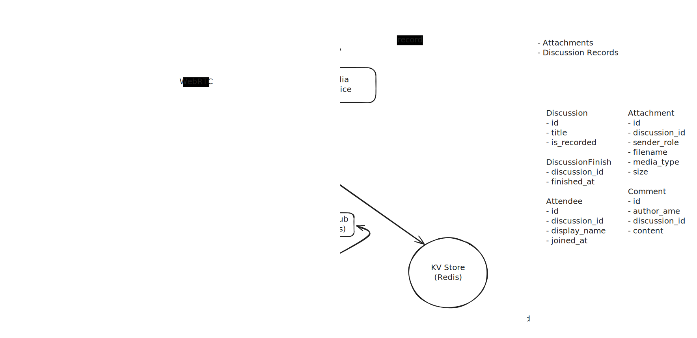

# IWouldArgue

A Highly Scalable Platform for Voice & Text Discussions

## Functional Requirements

* [x] Host starts a new discussion.
* [x] Host shares a discussion join link.
* [x] Attendees can raise hands to participate in the discussion.
* [x] Host promotes a hand-raised attendee to participant.
* [x] Hosts and participants can share attachments (images and documents).
* [x] Attendees can post and view live comments.
* [x] Optional download of previous 7 days of discussions with comment playback.

---

## Non-Functional Requirements

* [x] Support discussions up to 3 hours long.
* [x] 10K concurrent live discussions.
* [x] 500K discussions per day.
* [x] 5 comments per second per discussion.
* [x] 1K attendees per discussion.
* [x] Real-time voice discussions (< 500 ms latency).
* [x] Near real-time live comment delivery (< 3 s).
* [x] Attachments up to 30 MB.

---

## System Design

### High-Level Design

### Main Components

* **API Gateway**
  Handles authentication headers and request routing.

* **Metadata Service**
  Stores discussions, attendees, comments, and other discussion-related events.

* **Notification Service**
  Delivers new comments and attachment events to users participating in a discussion.

* **Media Service**
  An abstraction layer over LiveKit (SFU), responsible for room creation, deletion, token generation, and recording.

* **Metadata Database**
  Stores metadata managed by the Metadata Service.

* **Pub/Sub Channels**
  Routes new comment and attachment events to the appropriate Notification Service instances.

* **Key-Value Store**
  Stores highly changing values (e.g., raised hands, active notification service per discussion).

* **SFU (Selective Forwarding Unit)**
  Forwards WebRTC media streams between participants.

---

## Tech Choices

### Spring Boot

Used for `metadata-service` and `gateway`.

* Mature libraries for RESTful APIs, database access, and authentication.
* Strong ecosystem and production readiness.

### Rust

Used for `notification-service` and `media-service`.

* Efficient handling of thousands of SSE connections.
* Safe concurrency with near-zero runtime overhead.

### Cassandra (Metadata Database)

* Optimized for append-only writes.
* Horizontally scalable.
* Eventually consistent, avoiding the overhead of strong consistency where not required.

### Redis Pub/Sub over Streams

* Occasional message loss is acceptable.
* Prioritizes minimal latency over guaranteed delivery.

### Redis Sentinel (over Redis Cluster)

* Data size is relatively small, so sharding is unnecessary.
* Read-heavy access patterns fit well with a master–replica setup.
* Improved availability through replication.

### Redis Key-Value Store

* Designed for frequently changing records.
* Data is ephemeral and not retained long-term.
* Avoids Cassandra’s inefficiency with highly mutable data.

### LiveKit

* Mature WebRTC SFU with production-ready tooling.

### Server-Sent Events (SSE)

* Enables real-time updates with minimal bandwidth usage.
* Unidirectional server-to-client communication avoids WebSocket bidirectional overhead.

### WebRTC

* Provides low-latency, real-time audio streaming.

### Kubernetes

* Declarative infrastructure setup.
* Automatic scaling.
* Built-in load balancing.
* Service discovery.

---

## API Documentation

See the Swagger documentation for API details.
